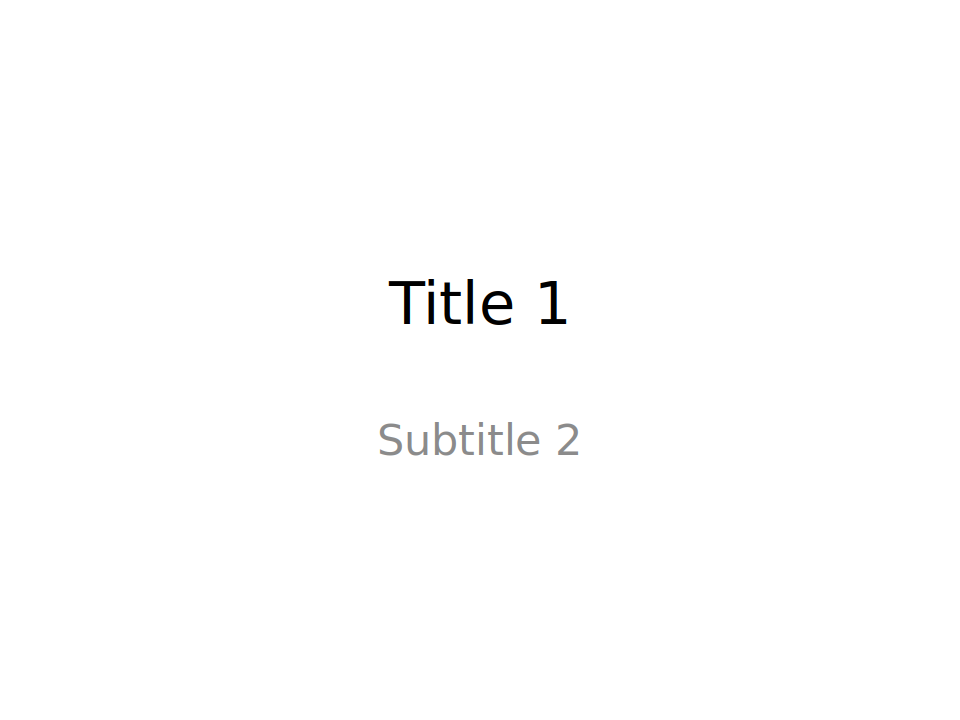
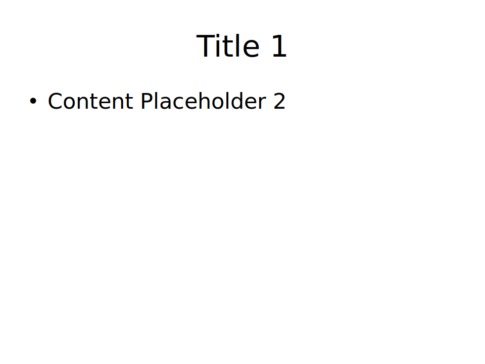
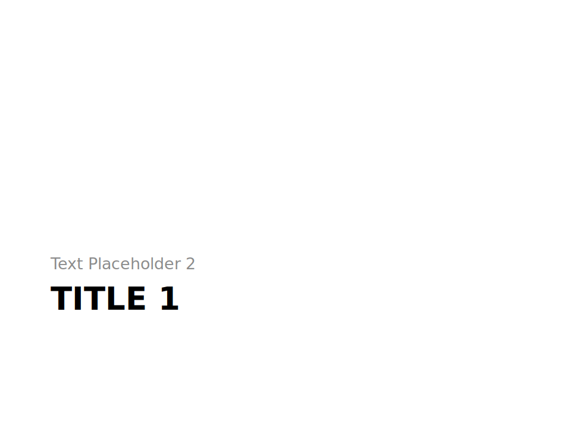
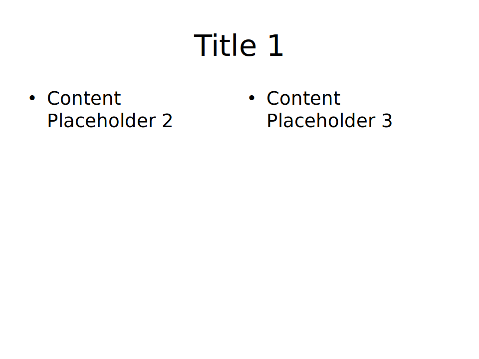
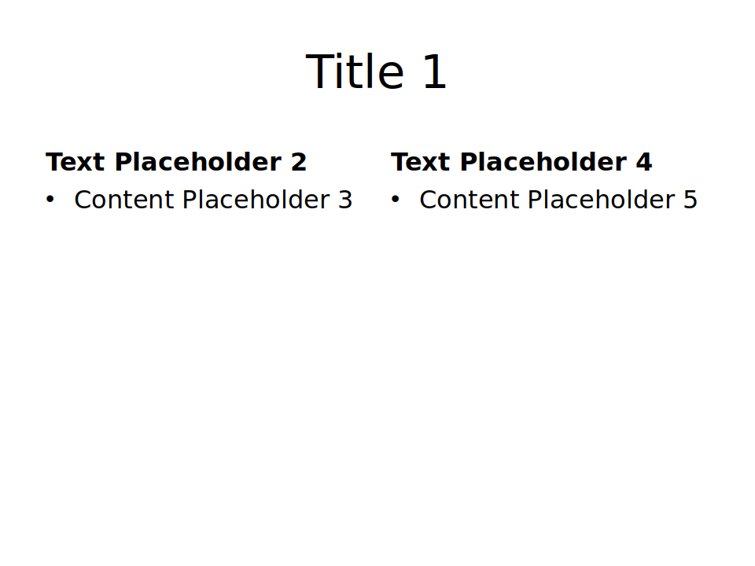
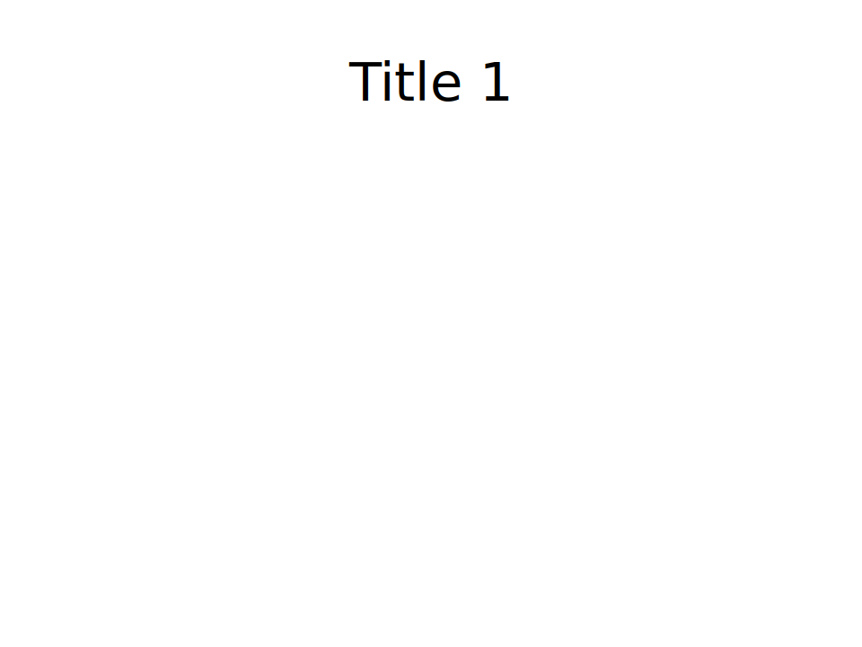
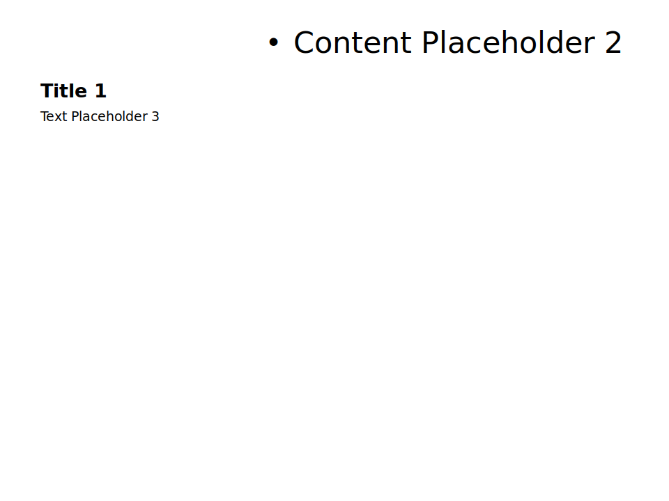
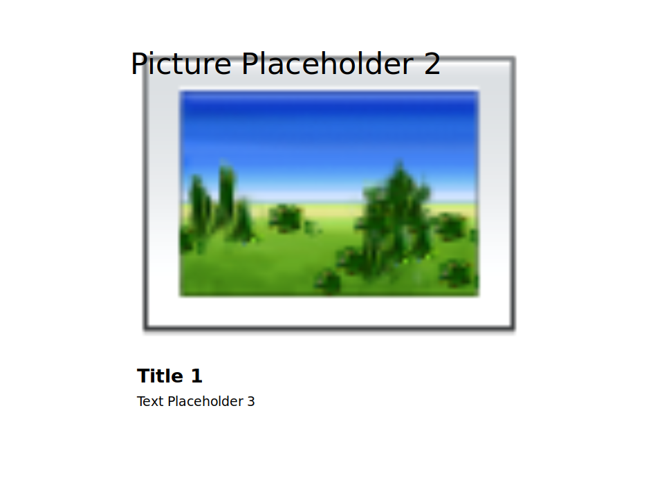

# python-pptx tutorial

[python-pptx — python-pptx 0.6.21 documentation](https://python-pptx.readthedocs.io/en/latest/index.html)

## Install 

```sh
pip install python-pptx
```

## Target Python Version

- Python 2.6, 2.7, 3.3, 3.4, or 3.6


## Slide layouts

```python
from pptx import Presentation

sld_layouts_idx = 0
placeholder_idx = 0

prs          = Presentation("test.pptx")
slide_layout = prs.slide_layouts[ sld_layouts_idx ]
slide        = prs.slides.add_slide(slide_layout)
placeholder  = slide.placeholders[placeholder_idx]
placeholder.text = "Set your text and etc..."
```

**slide layouts list**

| Slide Image                                           | idx | layout               | idx | placeholder           |
| ----------------------------------------------------- | --- | -------------------- | --- | --------------------- |
| -                                                     | >   | slide_layouts        | >   | placeholders          |
|  | 0   | Title Slide          | 0   | Title                 |
| ^                                                     | ^   | ^                    | 1   | Subtitle              |
|  | 1   | Title and Content    | 0   | Title 1               |
| ^                                                     | ^   | ^                    | 1   | Content Placeholder 2 |
|  | 2   | Section Header       | 0   | Title 1               |
| ^                                                     | ^   | ^                    | 1   | Text Placeholder 2    |
|  | 3   | Two Content          | 0   | Title 1               |
| ^                                                     | ^   | ^                    | 1   | Content Placeholder 2 |
| ^                                                     | ^   | ^                    | 2   | Content Placeholder 3 |
|  | 4   | Comparison           | 0   | Title 1               |
| ^                                                     | ^   | ^                    | 1   | Text Placeholder 2    |
| ^                                                     | ^   | ^                    | 2   | Content Placeholder 3 |
| ^                                                     | ^   | ^                    | 3   | Text Placeholder 4    |
| ^                                                     | ^   | ^                    | 4   | Content Placeholder 5 |
|  | 5   | Title Only           | 0   | Title 1               |
|  | 6   | Blank                | -   | -                     |
|  | 7   | Content with Caption | 0   | Title 1               |
| ^                                                     | ^   | ^                    | 1   | Content Placeholder 2 |
| ^                                                     | ^   | ^                    | 2   | Text Placeholder 3    |
|  | 8   | Picture with Caption | 0   | Title 1               |
| ^                                                     | ^   | ^                    | 1   | Picture Placeholder 2 |
| ^                                                     | ^   | ^                    | 2   | Text Placeholder 3    |


## Shape list

- [MSO_AUTO_SHAPE_TYPE — python-pptx 0.6.21 documentation](https://python-pptx.readthedocs.io/en/latest/api/enum/MsoAutoShapeType.html)
- [python-pptxの図形一覧 - Qiita](https://qiita.com/fuji3195/items/5e1a2f5760e98ac7116b)

| Graphic                                                  | MSO_AUTO_SHAPE_TYPE     |
| -------------------------------------------------------- | ----------------------- |
|  | ACTION_BUTTON_BEGINNING |
|             | LINE_INVERSE            |

ぼちぼち追加するか…

## Commentの書き方

[numpydoc]((https://numpydoc.readthedocs.io/en/latest/format.html#docstring-standard))になるべく準ずる（なるべく….


